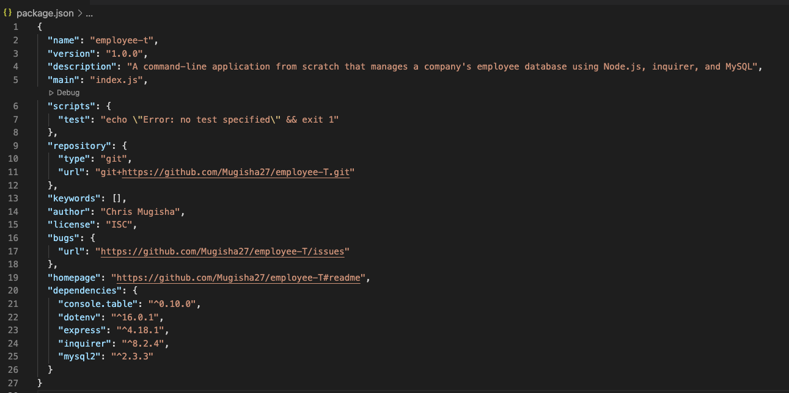

AS A business owner
I WANT to be able to view and manage the departments, roles, and employees in my company
SO THAT I can organize and plan my business

## DESCRIPTION
A command-line application from scratch that manages a company's employee database using Node.js, inquirer, and MySQL.

## TABLE OF CONTENTS
- [INSTALLATION](#installation)
- [LICENSE](#license)
- [QUESTIONS](#questions)

## INSTALLATION
nmp packages used: The MySQL2 package to connect to your MySQL database and perform queries, the Inquirer package to interact with the user via the command line, and the console.table package to print MySQL rows to the console.
                    

    
## LICENSE

The license included for the project is under MIT License

## CHALLENGES FACED
Being able to upload all the media files into the Readme file

## FUTURE DEVELOPMENTS
Not much beside being somehow comfortable creating a project as such.

## QUESTIONS
If you have any further questions about this module or improvement ideas, please feel free to connect on either GitHub or LinkedIn, or email me at:
* GitHub: https://github.com/undefined
* LinkedIn: undefined
* E-Mail: mondclear@gmail.com